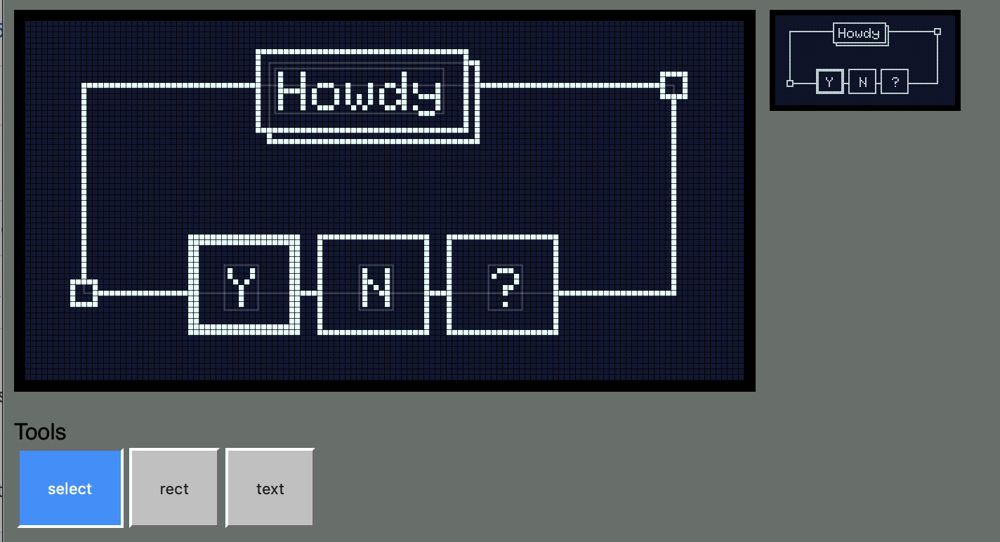

# DisplayGenerator

*Tool to help design SSD1306 OLED displays on Particle devices*

I like to use the SSD1306-based displays in Particle projects. They're small and inexpensive. There are three commonly used versions:

- 128 x 64 white (0.96") 
- 128 x 32 short
- 128 x 64 yellow and blue, with the top 16 pixels yellow and the rest blue

They're available with I2C and SPI interfaces. I recommend I2C; it's fewer pins (D0 and D1 only) and the added speed of SPI is not worth the effort in my opinion.

On Particle devices, the [Adafruit GFX library](https://github.com/adafruit/Adafruit-GFX-Library) is typically used to draw to the display. It works great, but it's kind of a pain to have to adjust a pixel or two, recompile and flash your code, and repeat the process over and over.

This project is a web-based tool that allows you to design your display code from a web browser with instantaneous feedback as you adjust fonts, positions, etc.. This saves a lot of pain over making a code change, flashing it to your device, viewing the display, and repeating.

The code actually runs the Adafruit GFX code in your browser so the display behavior, fonts, etc. are pixel-perfect to an actual device!

To use the tool, go to the [DisplayGenerator Web Page](https://aaaidan.github.io/DisplayGenerator/public/). (It's just the public directory of this repository served by Github Pages.)

## What can you do with it?

Here's a sample screen:

<a href="https://aaaidan.github.io/DisplayGenerator/public/"></a>

At the top is a zoomed display on the left and 1:1 display on the right.

The Display Type popup allows you to choose a different display type. It's currently limited to standard SSD1306 monochrome displays.

The list is populated by simple drawing objects, like text and rectangles.

As you edit the canvas, the app immediately updates the output code.

Save Layout and Load Layout can be used to save your design so you can load it later and continue to edit it.

## Shortcuts and tricks

Eventually this app is meant to be comfortable to those who are familiar with traditional vector drawing apps, like Illustrator. 

* `[` push selected objects back
* `Shift-[` push selected objects to back
* `]` bring selected objects forward
* `Shift-]` push selected objects to front
* `Backspace` `Delete` Delete selected objects.
* `Alt drag` Duplicate selected objects.

## Roadmap

Eventually I'd like to get this to a place where you can build a complex view, export it to your Arduino app, and control it with simple parameters that you expose to your app code.

```
// Something like this... this is a rough, impressionistic example...

#include './dynamic_view.h'
DynamicView myDynamic;

setup() {
  // ...
}

loop() {
  // update parameters...
  
  myDynamicView.render(button_a_down, button_b_down, tab_index, temperature_str);
}
```

In no particular order.

* Circles, lines and polylines, rounded rectangles, polygons
* Groups
* Custom and built-in icons, bitmaps
  * Paste bitmaps from clipboard
* Fonts
* Shape properties (transparent, stroke and fill colors, stroke width)
* Undo/redo
* Copy-paste within app
* Parameterization of properties (visibility, stroke, fill, strings)
* Components
* Screens? Transitions?
* Offline webapp?
  * Working with local folders (automatically overwrite export?)
* Efficient re-rendering? (Only re-render what has updated)
* Refactor, modernize js
  * Require and make use of ES6
  * Consider dropping Vue. Seems fine

## How it works

The entire thing is browser-based. It probably won't work on Edge, and it definitely won't work on Internet Explorer. 

There are two main parts:

- The user interface part is a Vue.js application.
- The Adafruit GFX code runs using Emscripten.

[Emscripten](https://emscripten.org) takes C++ code and compiles it to WebASM. I have the Adafruit GFX library and some necessary utilities (like String) as the C++ source in the src directory. 

Emscripten generates the necessary bindings so I can call C++ code from Javascript. I added wrappers for all of the GFX calls and a call to read the bitmap data out as an array of bytes.

## Releases

#### 0.0.3-aidan
- First forked release.
- Make it more about primitive display objects and less about draw commands.

#### 0.0.3

- Add gap between the yellow and blue parts of the display like an actual display.
- Add Invert Display option
- Add setTextColor(WHITE) by default
- Add setTextColor inverted option (only works with default font)
- Add clearDisplay() and display() to code automatically

#### 0.0.2 2019-07-23 

- Added printCentered option. Note that this only centers static text since GFX doesn't include a feature to automatically center text on the fly. It measures the text and generates the appropriate setCursor for you.

#### 0.0.1 2019-07-22 

Initial version!
